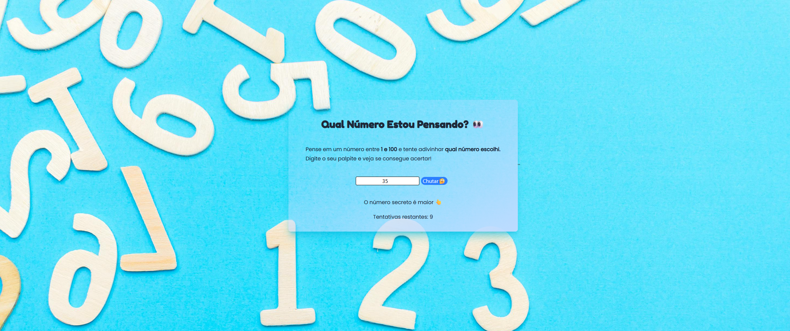

# 🎮 Jogo de Adivinhação

Este é um projeto interativo desenvolvido para treinar manipulação do DOM, funções em JavaScript e estilização com Tailwind CSS. 

O objetivo é simples: adivinhar um número secreto entre 1 e 100 com até 10 tentativas.
<br>

## ✨ Sobre o Jogo

Neste jogo, um número aleatório entre 1 e 100 é gerado automaticamente. O jogador digita seu palpite e recebe dicas se o número é **maior**, **menor** ou **correto**. O jogo também controla o número de tentativas restantes e oferece a opção de reiniciar ao final.



<br>

## 📁 Estrutura de Arquivos

O projeto está organizado da seguinte forma:

- `index.html`: Página principal do jogo.
- `game.js`: Script que contém a lógica de adivinhação.
- `src/`: Arquivos de estilo gerados pelo Tailwind.
- `img/`: Imagens utilizadas na interface.
- `favicon/`: Ícones personalizados.
- `package.json`: Configurações do projeto e dependências.
- `.vscode/`: Configurações do ambiente de desenvolvimento.  
<br>

## 🛠️ Tecnologias Utilizadas

[](https://developer.mozilla.org/en-US/docs/Web/HTML)
[](https://developer.mozilla.org/en-US/docs/Web/CSS)
[](https://developer.mozilla.org/en-US/docs/Web/JavaScript)
[](https://tailwindcss.com/)

<br>

## ▶️ Como Rodar o Projeto

1. **Clone o repositório:**
   ```bash
   git clone https://github.com/ItsRAYKA/EBAC-Projetos-Exerc-cios.git
   ```
 2. **Navegue até a pasta do projeto:**

```bash
cd EBAC-Projetos-Exerc-cios/Jogo de Adivinhacao
```
Abra o arquivo `index.html` no seu navegador:
Você pode clicar duas vezes no arquivo ou usar uma extensão como Live Server no VS Code.
