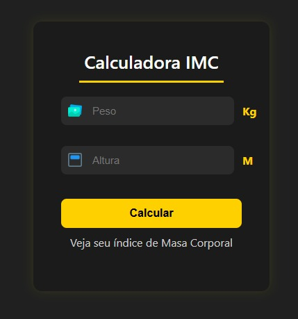

# 🧮Calculadora de IMC

Este é um projeto simples de calculadora de Índice de Massa Corporal (IMC), desenvolvido como parte da introdução ao JavaScript no curso de Desenvolvimento Full Stack da EBAC.

  

## ✨Funcionalidades
- Calcula o IMC com base no peso (kg) e altura (m).
- Exibe o resultado e a classificação do IMC (abaixo do peso, normal, sobrepeso, etc.).

## 🛠️Tecnologias Utilizadas

## ▶️Como Rodar

1. Clone este repositório para sua máquina local:
   `git clone https://github.com/Raylunaris/EBAC-Projetos-Exerc-cios.git`
2. Navegue até a pasta do projeto:
   `cd EBAC-Projetos-Exerc-cios/Modulo-JavaScript-Basico/CalculadoraIMC`
3. Abra o arquivo `index.html` em seu navegador.

