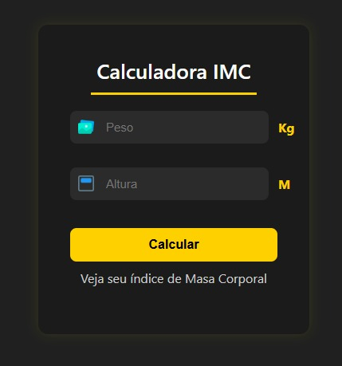

# 🧮Calculadora de IMC

Este é um projeto de calculadora de Índice de Massa Corporal (IMC), desenvolvido com foco no uso de estruturas condicionais para validações.

## 🖼️ Preview do Projeto

<p align="center">
  
</p>

## ✨ Funcionalidades

- Calcula o IMC com base no peso (kg) e altura (m).
- Exibe o resultado e a classificação do IMC (abaixo do peso, normal, sobrepeso, etc.).

## 🛠️Tecnologias Utilizadas


## ▶️ Como Rodar o projeto 

1. Clone este repositório:
   
  ```bash
git clone https://github.com/ItsRAYKA/frontend-projects.gi
  ```
2. Navegue até a pasta do projeto:
   
 ```bash
cd frontend-projects/imc-calculator
  ```
3. Abra o arquivo `index.html` em seu navegador.

## ✒️ Aprendizados
- Manipulação do DOM
- Uso de estruturas condicionais (`if / else if`)
- Validação de dados de entrada
- Organização da lógica de cálculo do IMC
