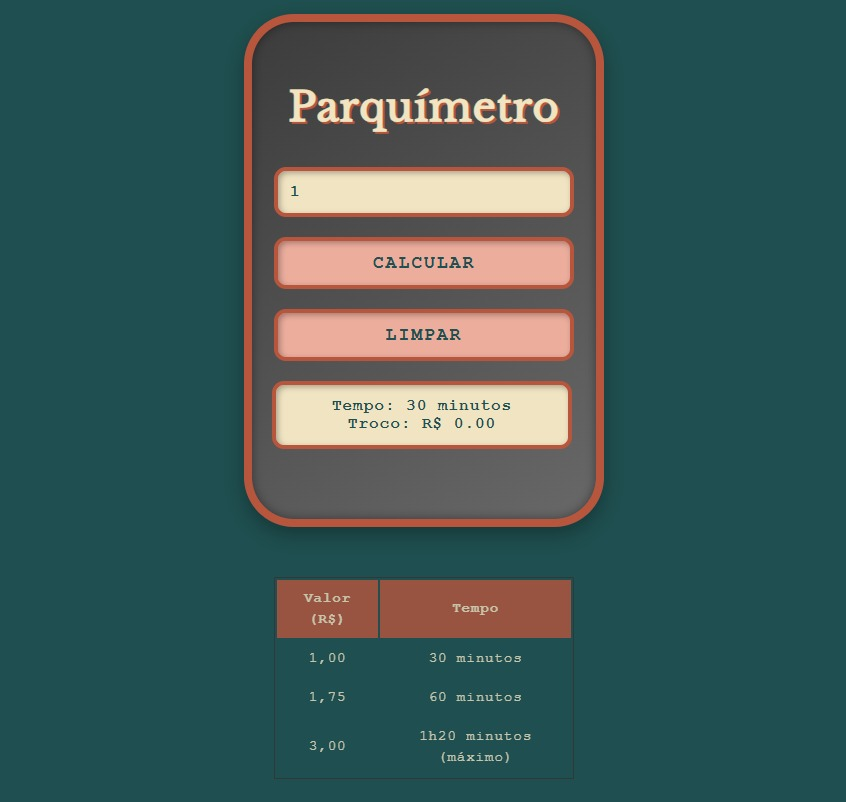

# Projeto Parquímetro Interativo 🅿️

Este projeto é uma aplicação web interativa que simula um parquímetro digital, desenvolvida com foco em Programação Orientada a Objetos (POO) em JavaScript. O objetivo é permitir ao usuário inserir um valor e, com base nesse valor, calcular o tempo de estacionamento correspondente e o troco, se aplicável.

## 🌟 Visão Geral e Objetivos

O principal objetivo deste projeto foi aplicar os conceitos de Programação Orientada a Objetos (POO) em JavaScript para criar uma aplicação prática e interativa. A simulação de um parquímetro oferece um cenário real para demonstrar como classes e objetos podem organizar a lógica de um programa de forma eficiente e modular.

Os objetivos específicos incluem:

- Desenvolver uma interface de usuário simples e intuitiva.
- Implementar a lógica de cálculo de tempo e troco utilizando POO.
- Tratar diferentes cenários de entrada de usuário (valor suficiente, valor insuficiente).
- Proporcionar uma experiência interativa ao usuário.

## 🖼️ Preview do Projeto



## 🚀 Tecnologias Utilizadas


## ✨ Funcionalidades

A aplicação possui as seguintes funcionalidades principais:

1. **Entrada de Valor:** O usuário pode inserir um valor em reais (R$) no campo de entrada.
2. **Tabela de Preços:** Os valores e tempos disponíveis são definidos em um objeto JavaScript e transformados em lista para facilitar a busca:
   - **R$ 1,00 → 30 minutos**
   - **R$ 1,75 → 60 minutos**
   - **R$ 3,00 → 120 minutos (tempo máximo)**
3. **Cálculo de Tempo:**
   - O método `calcularTempo()` busca o valor na lista e retorna o tempo correspondente.
   - Se o valor for menor que R$ 1,00, retorna mensagem de "Valor insuficiente".
   - Se o valor for maior que R$ 3,00, atribui automaticamente o tempo máximo (120 minutos).
4. **Cálculo de Troco:**
   - O método `calcularTroco()` compara o valor inserido com o valor máximo da tabela.
   - Se o valor for maior que R$ 3,00, calcula o troco como diferença entre o valor inserido e o máximo.
   - Caso contrário, o troco é `0`.
5. **Exibição de Resultados:**
   - O método `exibirResultado()` mostra o tempo e o troco calculados.
   - Se o valor for insuficiente, exibe um alerta e limpa os campos de resultado.
6. **Limpeza de Campos:**
   - O método `limparResultado()` adiciona um evento ao botão "Limpar", que apaga o valor digitado e os resultados exibidos.
7. **Validação de Entrada:**
   - Se o valor inserido for **menor que R$ 1,00**, uma mensagem de "Valor insuficiente!" é exibida.
   - A aplicação lida com entradas inválidas (não numéricas) evitando erros.

## ⚙️ Como Rodar a Aplicação

Para visualizar e interagir com o projeto, siga os passos abaixo:

1.  **Clone o Repositório:**
    ```bash
    git clone [https://github.com/Raylunaris/EBAC-Projetos-Exerc-cios.git](https://github.com/Raylunaris/EBAC-Projetos-Exerc-cios.git)
    ```
2.  **Naveegue até a Pasta do Projeto:**
    Após clonar, entre na pasta principal do repositório e, em seguida, na pasta `EBAC-Exercicios` onde o projeto Parquímetro está localizado.
    ```bash
    cd EBAC-Projetos-Exerc-cios/EBAC-Exercicios
    ```
3.  **Abra o `index.html`:**
    Simplesmente abra o arquivo `index.html` no seu navegador web preferido (Chrome, Firefox, Edge, etc.). Você pode fazer isso clicando duas vezes no arquivo ou arrastando-o para a janela do navegador.

## 💡 Aprendizados e Desafios

Durante o desenvolvimento deste projeto, tive a oportunidade de aprofundar meus conhecimentos em:

- **Programação Orientada a Objetos em JavaScript:** Reforcei o entendimento de classes, construtores, métodos e instâncias de objetos para modelar a lógica do parquímetro.
- **Manipulação do DOM:** Pratiquei a interação entre JavaScript e o HTML para dinamicamente exibir resultados e responder às ações do usuário.
- **Lógica Condicional e Aritmética:** Aprimorei a capacidade de criar algoritmos para calcular o tempo e o troco com base em regras específicas.
- **Tratamento de Entrada do Usuário:** Lidar com diferentes formatos de entrada e garantir que a aplicação responda de forma robusta.

---
